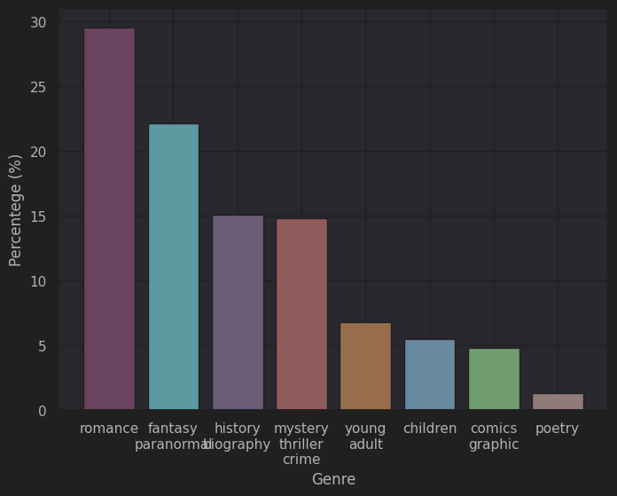
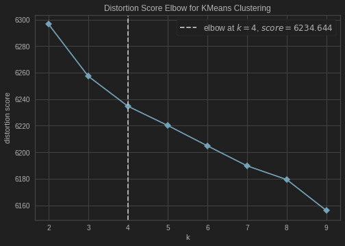
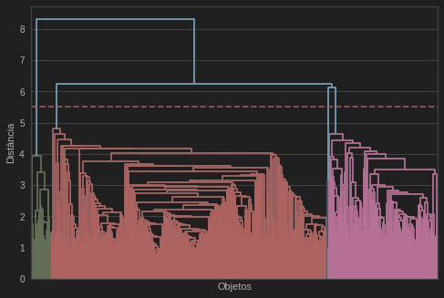
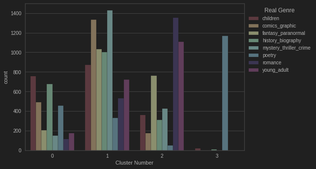
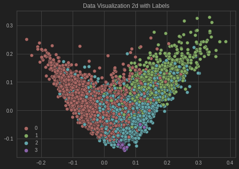

# Unsupervised cluster with NLP in Textual Genre
There're three main procedures in this work:
1. Create Dataset
2. Applies NLP into dataset
3. Unsupervised cluster

## 1. Create Dataset
The source data are divide in .json files of each textual genre. For this reason, `CreateDataset.ipnyb` take each file and join them
in a .json file named as `goodreads_books.json`, which will be the data used in classification

The data can be found in this [site](https://sites.google.com/eng.ucsd.edu/ucsdbookgraph/home)

--

Both procedures 2 and 3 are applied in the `ClusterTextualGenre.ipynb`

## 2. Applies NLP into dataset
First we take a look in the textual genre distribution

As wee see, the dataset is imbalanced, therefore we took **2000 samples** for each genre. It's relevant to point that we didn't use
more samples for the lack of computacional power.

Then we applied a **tokenization** with **text cleaning** where some non-important info were removed, as ponctuation, special characters, and others.
From the tokens the **TFIDF** matrix were computed. After that, we reduced the dimensional of **TFIDF** matrix with **TruncatedSVD**, cause the matrix were sparse
and this method are more efficient.

## 3. Unsupervised cluster

First, we analyze the best **number of groups** with kElbowMethod, using kmeans, and Dendogram:

Then, applied two unsupervised methods for clustering, KMeans and Hierachical Cluster, where the KMeans got the best score. 
Thereafter, we made some visualization of the results:
##### 1. The distribution of the clusters got from Kmeans:

##### 2. A 2D visualization of the clusters

##### Authors: 
+ Igor Varejão
+ Vitor Bonella 
